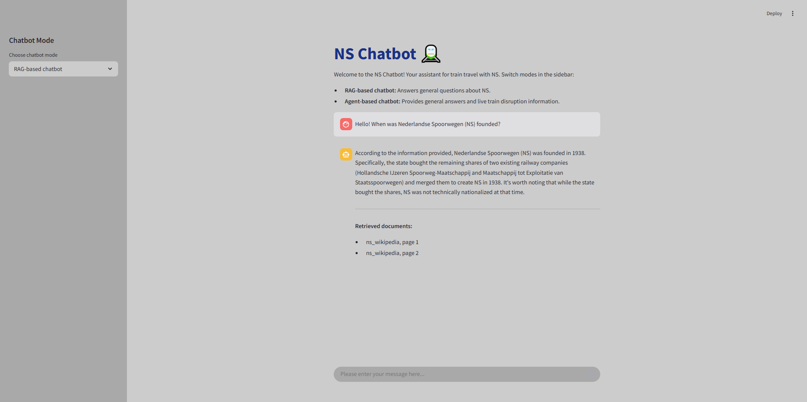
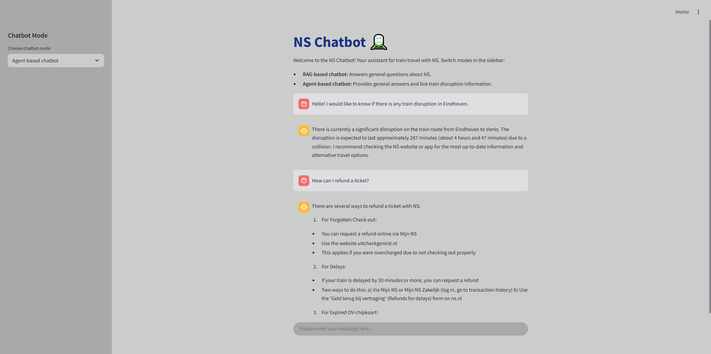

# NS Chatbot

NS chatbot is a helpful assistant that helps travellers with information regarding travelling by train with NS and train disruptions in the Netherlands.

It has the ability to answer questions based on a [guide](https://www.ns.nl/binaries/_ht_1575971177922/content/assets/ns-en/terms/travelling-with-ns.pdf) released by NS and the information from the NS Wikipedia [page](https://en.wikipedia.org/wiki/Nederlandse_Spoorwegen).

The project was developed utilizing exclusively AWS services and has two main modes, which are presented below. Both variants leverage Claude 3.5 Haiku, Amazon OpenSearch Serverless knowledge base, and Cohere Embed English V3 as the embedding model.

### RAG-based chatbot

It answers questions and provides the name and page of the retrieved documents used to craft the answer. However, it cannot answer questions about train disruptions.



### Agent-based chatbot

It answers to questions and provides the name and page of the utilized documents to generate the answer, and can answer questions about disruptions by leveraging a mocked-up tool with information about this for the vast majority of train stations in the Netherlands.





### Project structure

The project structure is described below:

```
├───.streamlit - contains the style configuration for the Steamlit UI
├───data - contains the used documents for RAG and questions for testing the chatbot
├───images - stores images that are displayed in this README file
├───src
│   ├───config.py - stores LLM hyperparameters, prompts, and identifiers for agents, knowledge base, etc.
│   ├───ns_chatbot_agent.py - code for the agent chatbot which utilizes the disruptions tool
│   ├───ns_chatbot_rag.py - code for the chatbot with RAG implemented manually
│   ├───ns_chatbot.py - store the class extended by RAG-based and agent-based chatbot classes
│   ├───utils.py - script for loading env variables and the zip of the Lambda function to S3
│   └───disruptions_lambda - the code for the Lambda function and the disruptions data (includes their zip)
├───Dockerfile
├───ns_chatbot_app.py - the main script which defines the UI and interaction with the chatbot
└───requirements.txt
```

## Testing

The prompts were engineered based on a list of [questions](data/questions.md) that cover the large majority of scenarios. The testing was done manually, and the performance was maximized across 3 criteria:
- factual accuracy (to avoid hallucinations)
- completeness
- coherence

Based on the tests, the chatbot provides correct and useful answers while politely refusing to answer questions about other topics.

## Quick start guide

The project was developed on a Windows machine, so the AWS credentials are stored at `C:\Users\Bogdan\.aws`. To run this project, you would need the same credentials to access the configured AWS services. The project was packaged with Docker for portability. To run it locally, please follow the steps:

1. Clone the project

```sh
git clone https://github.com/Bindila-Bogdan/NS-Chatbot.git
```

2. Build the Docker image

```sh
docker build -t ns_chatbot .
```

3. Run the Docker container

```sh
docker run -p 8501:8501 -v /c/Users/Bogdan/.aws:/root/.aws:ro  ns_chatbot
```

4. Interact with the chatbot by accessing `http://localhost:8501`.

5. Have fun!


## Future Enhancements

- [ ] Include presentation slides
- [ ] Add tests
- [ ] Add a CI/CD pipeline 
- [ ] Deploy the chatbot on an EC2 instance
